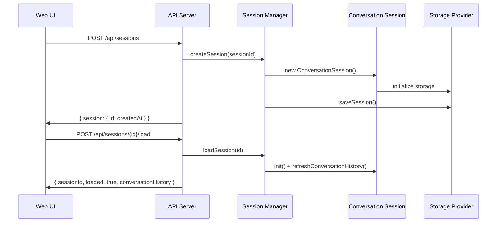
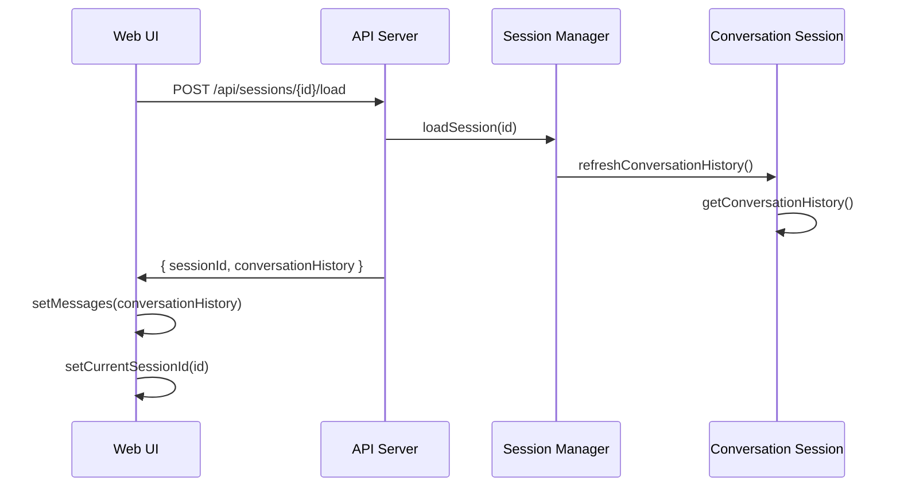
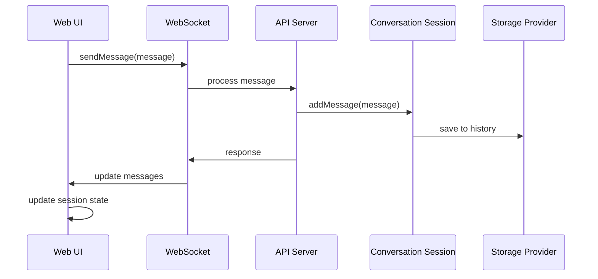

# Persistent Sessions and Web UI Communication Architecture

## Overview

This document provides a comprehensive overview of how persistent sessions work in the Cipher application, including the communication flow between the backend session management system and the Web UI frontend.

## Table of Contents

1. [Architecture Overview](#architecture-overview)
2. [Backend Session Management](#backend-session-management)
3. [Frontend Session Management](#frontend-session-management)
4. [Communication Flow](#communication-flow)
5. [Storage Layer](#storage-layer)
6. [Initialization Process](#initialization-process)
7. [Session Lifecycle](#session-lifecycle)
8. [Error Handling](#error-handling)
9. [Performance Optimizations](#performance-optimizations)

## Architecture Overview

The persistent session system consists of several interconnected layers:

```
┌─────────────────┐    ┌─────────────────┐    ┌─────────────────┐
│   Web UI        │    │   API Server    │    │   Storage       │
│   (React)       │◄──►│   (Express)     │◄──►│   (SQLite/DB)   │
└─────────────────┘    └─────────────────┘    └─────────────────┘
         │                       │                       │
         │                       │                       │
         ▼                       ▼                       ▼
┌─────────────────┐    ┌─────────────────┐    ┌─────────────────┐
│   Chat Context  │    │  Session Manager│    │  History Provider│
│   (State Mgmt)  │    │  (Core Logic)   │    │  (Persistence)  │
└─────────────────┘    └─────────────────┘    └─────────────────┘
```

## Backend Session Management

### Core Components

#### 1. Session Manager (`src/core/session/session-manager.ts`)

The central orchestrator for session management:

```typescript
export class SessionManager {
  private sessions: Map<string, SessionMetadata> = new Map();
  private storageManager?: StorageManager;
  private readonly maxSessions: number;
  private readonly sessionTTL: number;
}
```

**Key Responsibilities:**
- Session creation, loading, and removal
- Memory management (session eviction)
- Storage coordination
- Activity tracking

#### 2. Conversation Session (`src/core/session/coversation-session.ts`)

Individual session instances:

```typescript
export class ConversationSession {
  private contextManager!: ContextManager;
  private _historyProvider?: IConversationHistoryProvider;
  private _storageManager?: StorageManager;
  private historyEnabled: boolean = true;
}
```

**Key Responsibilities:**
- Message history management
- Context management
- Storage integration
- Session serialization/deserialization

#### 3. MemAgent (`src/core/brain/memAgent/agent.ts`)

High-level session coordination:

```typescript
export class MemAgent {
  public readonly sessionManager!: SessionManager;
  private currentActiveSessionId: string = 'default';
}
```

**Key Responsibilities:**
- Session API coordination
- LLM service management
- Tool management
- Session switching

### Storage Layer

#### 1. Storage Manager (`src/core/storage/manager.ts`)

Abstracts storage backends:

```typescript
export class StorageManager {
  private backends: {
    database?: DatabaseBackend;
    cache?: CacheBackend;
  };
}
```

**Supported Backends:**
- SQLite (default)
- PostgreSQL
- In-Memory (for testing)

#### 2. History Provider (`src/core/brain/llm/messages/history/database.ts`)

Handles conversation persistence:

```typescript
export class DatabaseHistoryProvider implements IConversationHistoryProvider {
  async addMessage(message: any): Promise<void>
  async getMessages(): Promise<any[]>
  async clearMessages(): Promise<void>
}
```

## Frontend Session Management

### Core Components

#### 1. Chat Context (`src/app/ui/src/contexts/chat-context.tsx`)

Global state management for sessions:

```typescript
export function ChatProvider({ children, wsUrl, autoConnect }: ChatProviderProps) {
  const [currentSessionId, setCurrentSessionId] = useState<string | null>(null);
  const [isWelcomeState, setIsWelcomeState] = useState(true);
  const [isStreaming, setIsStreaming] = useState(false);
}
```

**Key Responsibilities:**
- Session state management
- UI state coordination
- API communication
- Real-time updates

#### 2. Session Panel (`src/app/ui/src/components/session-panel.tsx`)

UI component for session management:

```typescript
export function SessionPanel({ 
  isOpen, 
  onClose, 
  currentSessionId, 
  onSessionChange, 
  returnToWelcome 
}: SessionPanelProps) {
  const [sessions, setSessions] = React.useState<Session[]>([]);
  const [loading, setLoading] = React.useState(false);
  const [error, setError] = React.useState<string | null>(null);
}
```

**Key Responsibilities:**
- Session listing and display
- Session creation/deletion
- Error handling
- Real-time updates

#### 3. Chat Hook (`src/app/ui/src/hooks/use-chat.ts`)

WebSocket and API communication:

```typescript
export function useChat(wsUrl?: string, autoConnect = true) {
  const [messages, setMessages] = useState<ChatMessage[]>([]);
  const [isConnected, setIsConnected] = useState(false);
  const [error, setError] = useState<string | null>(null);
}
```

**Key Responsibilities:**
- WebSocket connection management
- Message sending/receiving
- API communication
- State synchronization

## Communication Flow

### 1. Session Creation Flow



### 2. Session Switching Flow



### 3. Message Persistence Flow



## Storage Layer

### 1. Database Schema

#### Sessions Table
```sql
CREATE TABLE sessions (
  id TEXT PRIMARY KEY,
  created_at INTEGER,
  last_activity INTEGER,
  metadata TEXT
);
```

#### Messages Table
```sql
CREATE TABLE messages (
  id INTEGER PRIMARY KEY AUTOINCREMENT,
  session_id TEXT,
  message_data TEXT,
  timestamp INTEGER,
  FOREIGN KEY (session_id) REFERENCES sessions(id)
);
```

### 2. Storage Operations

#### Session Persistence
```typescript
// Save session metadata
await storageManager.set(`session:${sessionId}`, {
  id: sessionId,
  createdAt: Date.now(),
  lastActivity: Date.now(),
  metadata: sessionMetadata
});

// Save conversation history
await storageManager.set(`messages:${sessionId}`, conversationHistory);
```

#### Session Loading
```typescript
// Load session metadata
const sessionData = await storageManager.get(`session:${sessionId}`);

// Load conversation history
const history = await storageManager.get(`messages:${sessionId}`);
```

## Initialization Process

### 1. Backend Initialization

```typescript
// 1. Storage Manager Initialization
const storageManager = new StorageManager(config);
await storageManager.connect();

// 2. Session Manager Initialization
const sessionManager = new SessionManager(services, config);
await sessionManager.init();

// 3. MemAgent Initialization
const agent = new MemAgent(config);
await agent.start();

// 4. API Server Initialization
const app = express();
app.use('/api/sessions', createSessionRoutes(agent));
```

### 2. Frontend Initialization

```typescript
// 1. Chat Context Initialization
<ChatProvider wsUrl={wsUrl} autoConnect={true}>
  <App />
</ChatProvider>

// 2. Session Panel Initialization
<SessionPanel 
  isOpen={isOpen}
  onClose={onClose}
  currentSessionId={currentSessionId}
  onSessionChange={switchSession}
/>

// 3. WebSocket Connection
const ws = new WebSocket(wsUrl);
ws.onopen = () => setIsConnected(true);
ws.onmessage = (event) => handleMessage(JSON.parse(event.data));
```

### 3. Session Restoration

```typescript
// 1. Load persisted sessions
const persistedSessions = await sessionManager.loadAllSessions();

// 2. Restore conversation history
for (const session of persistedSessions) {
  await session.refreshConversationHistory();
}

// 3. Update UI state
setSessions(persistedSessions);
setCurrentSessionId(defaultSessionId);
```

## Session Lifecycle

### 1. Session Creation
```typescript
// Backend
const session = await agent.createSession(sessionId);
await session.init();
await session.refreshConversationHistory();

// Frontend
const newSession = await createAutoSession();
await switchSession(newSession);
```

### 2. Session Loading
```typescript
// Backend
const session = await agent.loadSession(sessionId);
await session.refreshConversationHistory();
const history = await session.getConversationHistory();

// Frontend
const sessionData = await loadSession(sessionId);
setMessages(convertHistoryToUIMessages(sessionData.conversationHistory));
```

### 3. Session Switching
```typescript
// Backend
await agent.loadSession(newSessionId);
const history = await agent.getSessionHistory(newSessionId);

// Frontend
setCurrentSessionId(newSessionId);
setMessages(convertHistoryToUIMessages(history));
```

### 4. Session Persistence
```typescript
// Backend
await sessionManager.saveAllSessions();

// Frontend
// Automatic via WebSocket events
```

### 5. Session Cleanup
```typescript
// Backend
await sessionManager.removeSession(sessionId);
await storageManager.delete(`session:${sessionId}`);
await storageManager.delete(`messages:${sessionId}`);

// Frontend
setSessions(sessions.filter(s => s.id !== sessionId));
```

## Error Handling

### 1. Backend Error Handling

```typescript
// Session loading errors
try {
  const session = await agent.loadSession(sessionId);
} catch (error) {
  const errorMsg = error instanceof Error ? error.message : String(error);
  logger.error('Failed to load session:', errorMsg);
  throw new Error(`Session loading failed: ${errorMsg}`);
}

// Storage errors
try {
  await storageManager.connect();
} catch (error) {
  logger.error('Storage connection failed:', error);
  // Fallback to in-memory storage
}
```

### 2. Frontend Error Handling

```typescript
// API error handling
try {
  const response = await fetch('/api/sessions');
  if (!response.ok) {
    const errorData = await response.json();
    const errorMessage = errorData.error?.message || 'Failed to fetch sessions';
    throw new Error(errorMessage);
  }
} catch (error) {
  setError(error instanceof Error ? error.message : String(error));
}

// WebSocket error handling
ws.onerror = (error) => {
  console.error('WebSocket error:', error);
  setIsConnected(false);
};
```

### 3. Error Recovery

```typescript
// Session recovery
if (sessionLoadFailed) {
  // Create new session
  const newSession = await createAutoSession();
  await switchSession(newSession);
}

// Storage recovery
if (storageConnectionFailed) {
  // Use in-memory storage
  const inMemoryStorage = new InMemoryStorage();
  await sessionManager.setStorageManager(inMemoryStorage);
}
```

## Performance Optimizations

### 1. Lazy Loading

```typescript
// Session components loaded on demand
const SessionPanel = React.lazy(() => import('./session-panel'));

// History loaded only when needed
const history = await session.getConversationHistory();
```

### 2. Caching

```typescript
// Session metadata caching
const sessionCache = new Map<string, SessionMetadata>();

// Message count caching
const messageCountCache = new Map<string, number>();
```

### 3. Debouncing

```typescript
// Session switching debounce
const [isSwitchingSession, setIsSwitchingSession] = useState(false);
const switchSessionTimeoutRef = useRef<NodeJS.Timeout | null>(null);

if (isSwitchingSession) {
  return; // Prevent rapid switching
}
```

### 4. Batch Operations

```typescript
// Batch session saves
await sessionManager.saveAllSessions();

// Batch history updates
await Promise.all(sessions.map(session => session.refreshConversationHistory()));
```

## API Endpoints

### Session Management

| Endpoint | Method | Description |
|----------|--------|-------------|
| `/api/sessions` | GET | List all sessions |
| `/api/sessions` | POST | Create new session |
| `/api/sessions/:id/load` | POST | Load session |
| `/api/sessions/:id/history` | GET | Get session history |
| `/api/sessions/:id` | DELETE | Delete session |

### Response Formats

#### Session List Response
```json
{
  "success": true,
  "data": {
    "sessions": [
      {
        "id": "session-1",
        "createdAt": "2024-01-01T00:00:00Z",
        "lastActivity": "2024-01-01T12:00:00Z",
        "messageCount": 5
      }
    ],
    "count": 1,
    "currentSession": "session-1"
  }
}
```

#### Session Load Response
```json
{
  "success": true,
  "data": {
    "sessionId": "session-1",
    "loaded": true,
    "conversationHistory": [
      {
        "role": "user",
        "content": "Hello",
        "timestamp": "2024-01-01T12:00:00Z"
      }
    ],
    "currentSession": "session-1"
  }
}
```

## WebSocket Events

### Event Types

| Event | Direction | Payload | Description |
|-------|-----------|---------|-------------|
| `session:created` | Server→Client | `{ sessionId, timestamp }` | New session created |
| `session:loaded` | Server→Client | `{ sessionId, messageCount }` | Session loaded |
| `session:deleted` | Server→Client | `{ sessionId }` | Session deleted |
| `message:sent` | Client→Server | `{ content, sessionId }` | Message sent |
| `message:received` | Server→Client | `{ content, sessionId, timestamp }` | Message received |

### Event Handling

```typescript
// Client-side event handling
window.addEventListener('cipher:sessionChanged', (event) => {
  const { sessionId } = event.detail;
  switchSession(sessionId);
});

// Server-side event emission
eventManager.emitSessionEvent(sessionId, SessionEvents.SESSION_CREATED, {
  sessionId,
  timestamp: Date.now()
});
```

## Configuration

### Environment Variables

```bash
# Storage Configuration
STORAGE_DATABASE_PATH=./data
STORAGE_DATABASE_NAME=cipher-sessions.db
STORAGE_DATABASE_TYPE=sqlite

# Session Configuration
SESSION_MAX_SESSIONS=100
SESSION_TTL=86400000  # 24 hours
SESSION_PERSISTENCE_ENABLED=true

# API Configuration
API_PORT=3001
API_HOST=localhost
```

### Configuration Objects

```typescript
// Session Manager Config
const sessionConfig: SessionManagerConfig = {
  maxSessions: 100,
  sessionTTL: 86400000,
  persistence: {
    enabled: true,
    storageKeyPrefix: 'session:',
    autoSave: true
  }
};

// Storage Config
const storageConfig = {
  database: {
    type: 'sqlite',
    path: './data',
    database: 'cipher-sessions.db'
  },
  cache: {
    type: 'in-memory'
  }
};
```

## Monitoring and Logging

### Logging Levels

```typescript
// Debug logging for development
logger.debug('Session created:', { sessionId, messageCount });

// Info logging for operations
logger.info('Session loaded:', { sessionId, historyLength });

// Warning logging for issues
logger.warn('Session loading failed:', { sessionId, error });

// Error logging for failures
logger.error('Storage connection failed:', { error, sessionId });
```

### Metrics

```typescript
// Session metrics
const sessionStats = {
  activeSessions: sessionManager.sessions.size,
  totalSessions: await sessionManager.getSessionCount(),
  storageConnected: storageManager.isConnected(),
  averageMessageCount: await calculateAverageMessageCount()
};
```

This comprehensive architecture ensures reliable, scalable, and performant persistent session management with proper error handling, monitoring, and optimization strategies. 