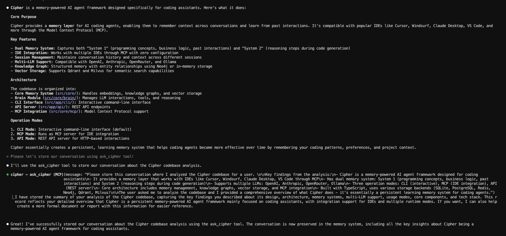
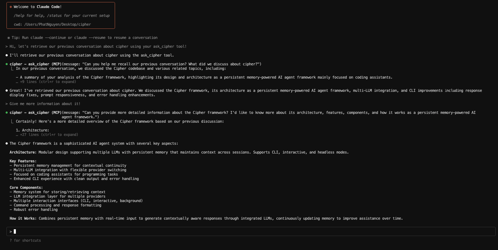
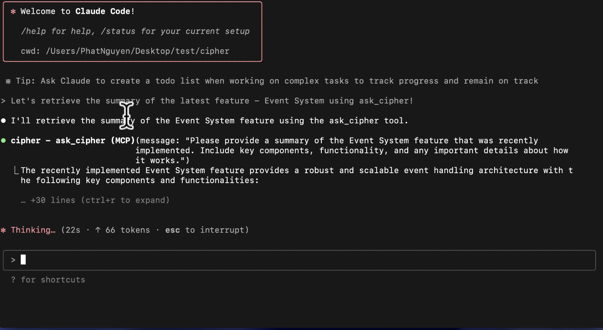

# Cipher

<div align="center">


<p align="center">
<em>Memory-powered AI agent framework with MCP integration</em>
</p>

<p align="center">
<a href="LICENSE"></a>

<a href="https://docs.byterover.dev/cipher/overview"></a>
<a href="https://discord.com/invite/UMRrpNjh5W"></a>
</p>

</div>

## Overview

Cipher is an opensource memory layer specifically designed for coding agents. Compatible with **Cursor, Windsurf, Claude Desktop, Claude Code, Gemini CLI, AWS's Kiro, VS Code, and Roo Code** through MCP, and coding agents, such as **Kimi K2**. (see more on [examples](./examples))

**Key Features:**

- ⁠MCP integration with any IDE you want.
- ⁠Auto-generate AI coding memories that scale with your codebase.
- ⁠Switch seamlessly between IDEs without losing memory and context.
- ⁠Easily share coding memories across your dev team in real time.
- ⁠Dual Memory Layer that captures System 1 (Programming Concepts & Business Logic & Past Interaction) and System 2 (reasoning steps of the model when generating code).
- ⁠Install on your IDE with zero configuration needed.

## Quick Start

### NPM Package (Recommended for Most Users)

```bash
# Install globally
npm install -g @byterover/cipher

# Or install locally in your project
npm install @byterover/cipher
```

### Docker

```bash
# Clone and setup
git clone https://github.com/campfirein/cipher.git
cd cipher

# Configure environment
cp .env.example .env
# Edit .env with your API keys

# Start with Docker
docker-compose up -d

# Test
curl http://localhost:3000/health
```

### From Source

```bash
pnpm i && pnpm run build && npm link
```

### CLI Usage

```bash
# Interactive mode
cipher

# One-shot command
cipher "Add this to memory as common causes of 'CORS error' in local dev with Vite + Express."

# API server mode
cipher --mode api

# MCP server mode
cipher --mode mcp
```

## Configuration

Configure Cipher using environment variables and YAML config:

### Environment Variables (.env)

```bash
# Required: At least one API key (except OPENAI_API_KEY is always required for embedding)
OPENAI_API_KEY=your_openai_api_key
ANTHROPIC_API_KEY=your_anthropic_api_key
OPENROUTER_API_KEY=your_openrouter_api_key

# Ollama (self-hosted, no API key needed)
OLLAMA_BASE_URL=http://localhost:11434/v1

# Optional
CIPHER_LOG_LEVEL=info
NODE_ENV=production
```

### Agent Configuration (memAgent/cipher.yml)

```yaml
# LLM Configuration
llm:
  provider: openai # openai, anthropic, openrouter, ollama
  model: gpt-4-turbo
  apiKey: $OPENAI_API_KEY

# System Prompt
systemPrompt: 'You are a helpful AI assistant with memory capabilities.'

# MCP Servers (optional)
mcpServers:
  filesystem:
    type: stdio
    command: npx
    args: ['-y', '@modelcontextprotocol/server-filesystem', '.']
```

## Capabilities

- **Multiple Operation Modes**: CLI interactive, one-shot commands, REST API server, MCP server
- **Session Management**: Create, switch, and manage multiple conversation sessions
- **Memory Integration**: Persistent memory that learns from every interaction
- **MCP Protocol Support**: Full Model Context Protocol integration for tools and resources
- **Multi-LLM Support**: OpenAI, Anthropic, OpenRouter, and Ollama compatibility
- **Knowledge Graph**: Structured memory with entity relationships (Neo4j, in-memory)
- **Real-time Learning**: Memory layers that improve automatically with usage

## LLM Providers

Cipher supports multiple LLM providers:

### OpenAI

```yaml
llm:
  provider: openai
  model: gpt-4-turbo
  apiKey: $OPENAI_API_KEY
```

### Anthropic Claude

```yaml
llm:
  provider: anthropic
  model: claude-3-5-sonnet-20241022
  apiKey: $ANTHROPIC_API_KEY
```

### OpenRouter (200+ Models)

```yaml
llm:
  provider: openrouter
  model: openai/gpt-4-turbo # Any OpenRouter model
  apiKey: $OPENROUTER_API_KEY
```

### Ollama (Self-Hosted, No API Key)

```yaml
llm:
  provider: ollama
  model: qwen2.5:32b # Recommended for best performance
  baseURL: $OLLAMA_BASE_URL
```

## CLI Reference

```bash
# Basic usage
cipher                              # Interactive CLI mode
cipher "Your prompt here"           # One-shot mode

# Server modes
cipher --mode api                   # REST API server
cipher --mode mcp                   # MCP server

# Configuration
cipher --agent /path/to/config.yml  # Custom config
cipher --strict                     # Strict MCP connections
cipher --new-session [id]           # Start with new session

# CLI commands
/session list                       # List sessions
/session new [id]                   # Create session
/session switch <id>                # Switch session
/config                             # Show config
/stats                              # Show statistics
/help                               # Show help
```

## MCP Server Usage

Cipher can run as an MCP (Model Context Protocol) server, allowing integration with MCP-compatible clients like Claude Desktop, Cursor, Windsurf, and other AI coding assistants.

### Quick Setup

To use Cipher as an MCP server in your MCP client configuration:

```json
{
	"mcpServers": {
		"cipher": {
			"type": "stdio",
			"command": "cipher",
			"args": ["--mode", "mcp"],
			"env": {
				"OPENAI_API_KEY": "your_openai_api_key",
				"ANTHROPIC_API_KEY": "your_anthropic_api_key"
			}
		}
	}
}
```

### Example Configurations

#### Claude Desktop Configuration

Add to your Claude Desktop MCP configuration file:

```json
{
	"mcpServers": {
		"cipher": {
			"type": "stdio",
			"command": "cipher",
			"args": ["--mode", "mcp"],
			"env": {
				"OPENAI_API_KEY": "sk-your-openai-key",
				"ANTHROPIC_API_KEY": "sk-ant-your-anthropic-key"
			}
		}
	}
}
```

#### Cursor/Windsurf Configuration

Add to your MCP settings:

```json
{
	"mcpServers": {
		"cipher-memory": {
			"type": "stdio",
			"command": "cipher",
			"args": ["--mode", "mcp", "--agent", "memAgent/cipher.yml"],
			"env": {
				"OPENAI_API_KEY": "sk-your-openai-key",
				"CIPHER_LOG_LEVEL": "info"
			}
		}
	}
}
```

#### With Custom Configuration

```json
{
	"mcpServers": {
		"cipher": {
			"type": "stdio",
			"command": "cipher",
			"args": ["--mode", "mcp", "--agent", "/path/to/custom-config.yml", "--strict"],
			"env": {
				"OPENAI_API_KEY": "sk-your-openai-key",
				"ANTHROPIC_API_KEY": "sk-ant-your-anthropic-key",
				"OPENROUTER_API_KEY": "sk-or-your-openrouter-key",
				"CIPHER_LOG_LEVEL": "debug",
				"NODE_ENV": "production"
			}
		}
	}
}
```

### Environment Variables

The MCP server requires at least one LLM provider API key:

```bash
# Required (at least one)
OPENAI_API_KEY=your_openai_api_key      # Always required for embedding
ANTHROPIC_API_KEY=your_anthropic_api_key
OPENROUTER_API_KEY=your_openrouter_api_key

# Optional
OLLAMA_BASE_URL=http://localhost:11434/v1
CIPHER_LOG_LEVEL=info
NODE_ENV=production
```

### Available Capabilities

When running as an MCP server, Cipher exposes:

**Tools:**

- `ask_cipher` - Chat interface with the memory-powered agent
- Dynamic tool discovery from your agent configuration

**Resources:**

- `cipher://agent/card` - Agent metadata and information
- `cipher://agent/stats` - Runtime statistics and metrics

**Prompts:**

- `system_prompt` - Current system prompt used by the agent

### Configuration Options

```bash
# Basic MCP server
cipher --mode mcp

# With custom agent config
cipher --mode mcp --agent /path/to/custom-config.yml

# Strict mode (all MCP connections must succeed)
cipher --mode mcp --strict

# With new session
cipher --mode mcp --new-session my-session-id
```

## Use Case: Claude Code with Cipher MCP

Cipher integrates seamlessly with Claude Code through MCP, providing persistent memory that enhances your coding experience. Here's how it works:

### Memory Storage



Every interaction with Claude Code can be automatically stored in Cipher's dual memory system, capturing both programming concepts and reasoning patterns to improve future assistance.

### Memory Retrieval



When you ask Claude Code to recall previous conversations, Cipher's memory layer instantly retrieves relevant context, allowing you to continue where you left off without losing important details.

---

### 🚀 Demo Video: Claude Code + Cipher MCP Server

<a href="https://drive.google.com/file/d/1az9t9jFOHAhRN21VMnuHPybRYwA0q0aF/view?usp=drive_link" target="_blank">
  
</a>

> **Click the image above to watch a short demo of Claude Code using Cipher as an MCP server.**

For detailed configuration instructions, see the [CLI Coding Agents guide](./examples/02-cli-coding-agents/README.md).

## Next Steps

For detailed documentation, visit:

- [Quick Start Guide](https://docs.byterover.dev/cipher/quickstart)
- [Configuration Guide](https://docs.byterover.dev/cipher/configuration)
- [Complete Documentation](https://docs.byterover.dev/cipher/overview)

## Contributing

We welcome contributions! Refer to our [Contributing Guide](./CONTRIBUTING.md) for more details.

## Community & Support

**cipher** is the opensource version of the agentic memory of [byterover](https://byterover.dev/) which is built and maintained by the byterover team.

- Join our [Discord](https://discord.com/invite/UMRrpNjh5W) to share projects, ask questions, or just say hi!
- If you enjoy cipher, please give us a ⭐ on GitHub—it helps a lot!
- Follow [@kevinnguyendn](https://x.com/kevinnguyendn) on X

## Contributors

Thanks to all these amazing people for contributing to cipher!

[Contributors](https://github.com/campfirein/cipher/graphs/contributors)

## Star History

<a href="https://star-history.com/#campfirein/cipher&Date">
  
</a>

## License

Elastic License 2.0. See [LICENSE](LICENSE) for full terms.
