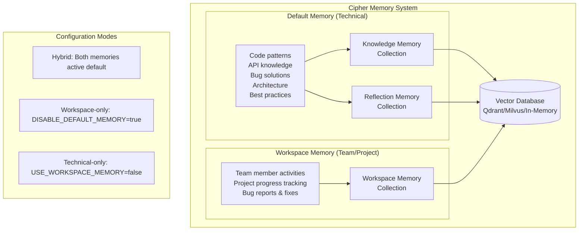

# Workspace Memory System

> **Team Collaboration Made Smart** - Automatically track project progress, team activities, and shared context with intelligent memory designed for modern development workflows.

## What Is Workspace Memory?

Workspace memory is Cipher's specialized memory system for teams. While Cipher's default memory focuses on technical knowledge and code patterns, workspace memory understands your team's collaborative work - tracking who's working on what, project progress, bug reports, and team context.

**Think of it as your team's shared brain** that automatically remembers:

- What John is working on this sprint
- Which bugs Sarah fixed last week
- The status of the authentication feature
- Which repositories and branches are active
- Team progress across different projects

## Quick Setup

### 1. Enable Workspace Memory

Add to your `.env` file:

### Required Settings

```bash
# Enable workspace memory
USE_WORKSPACE_MEMORY=true

# At least one API key for embeddings
OPENAI_API_KEY=your-openai-api-key-here
# OR
GEMINI_API_KEY=your-gemini-api-key-here
```

### Optional Settings

```bash
# Memory mode
DISABLE_DEFAULT_MEMORY=true              # Workspace-only mode

# Collection settings
WORKSPACE_VECTOR_STORE_COLLECTION=workspace_memory
WORKSPACE_SEARCH_THRESHOLD=0.4

# Vector store configuration (if different from main)
WORKSPACE_VECTOR_STORE_TYPE=qdrant       # qdrant, milvus, or in-memory
WORKSPACE_VECTOR_STORE_DIMENSION=1536
WORKSPACE_VECTOR_STORE_MAX_VECTORS=10000

# Qdrant configuration (only if WORKSPACE_VECTOR_STORE_TYPE=qdrant)
WORKSPACE_VECTOR_STORE_HOST=localhost
WORKSPACE_VECTOR_STORE_PORT=6333
WORKSPACE_VECTOR_STORE_URL=http://localhost:6333
WORKSPACE_VECTOR_STORE_API_KEY=your-qdrant-api-key

# Milvus configuration (only if WORKSPACE_VECTOR_STORE_TYPE=milvus)
WORKSPACE_VECTOR_STORE_HOST=localhost
WORKSPACE_VECTOR_STORE_PORT=19530
WORKSPACE_VECTOR_STORE_URL=your-milvus-endpoint
WORKSPACE_VECTOR_STORE_API_KEY=your-milvus-api-key
WORKSPACE_VECTOR_STORE_USERNAME=your-milvus-zilliz-cloud-username
WORKSPACE_VECTOR_STORE_PASSWORD=your-milvus-zilliz-cloud-password
```

### 2. Start Using

Just talk naturally about your team's work:

```
"John is working on the authentication feature and it's about 75% complete"
"Sarah fixed a critical bug in the payment processing module"
"We deployed version 2.1.0 to staging yesterday"
```

Workspace memory automatically captures and organizes this information.

### 3. Search Team Information

Ask questions about your team:

```
"What is John working on?"
"Recent bug fixes"
"Authentication feature status"
```

## How workspace_store Works

The `workspace_store` tool runs automatically in the background after each conversation, extracting team information and storing it with this structured payload:

### WorkspacePayload Structure

```typescript
interface WorkspacePayload {
	id: number;
	text: string;
	tags: string[];
	confidence: number;
	event: 'ADD' | 'UPDATE' | 'DELETE' | 'NONE';
	timestamp: string;
	version: number;

	// Workspace-specific fields
	teamMember?: string; // "john", "Sarah", "@mike"
	currentProgress?: {
		feature: string; // "authentication feature"
		status: 'in-progress' | 'completed' | 'blocked' | 'reviewing';
		completion?: number; // 0-100 percentage
	};
	bugsEncountered?: Array<{
		description: string; // "payment processing bug"
		severity: 'low' | 'medium' | 'high' | 'critical';
		status: 'open' | 'in-progress' | 'fixed';
	}>;
	workContext?: {
		project?: string; // "ecommerce-app"
		repository?: string; // "company/webapp"
		branch?: string; // "feature/auth-improvements"
	};
	domain?: string; // "frontend", "backend", "devops"
	sourceSessionId?: string; // Session that created this memory
	qualitySource: 'similarity' | 'llm' | 'heuristic';
}
```

### Example Extracted Data

**Input**: `"John is working on the authentication feature and it's about 75% complete"`

**Extracted Payload**:

```json
{
	"id": 1,
	"text": "John is working on the authentication feature and it's about 75% complete",
	"tags": ["team-work", "progress-update", "authentication"],
	"confidence": 0.9,
	"event": "ADD",
	"timestamp": "2024-01-15T10:30:00.000Z",
	"version": 2,
	"teamMember": "John",
	"currentProgress": {
		"feature": "authentication feature",
		"status": "in-progress",
		"completion": 75
	},
	"domain": "backend",
	"sourceSessionId": "session-abc123",
	"qualitySource": "llm"
}
```

## Memory Architecture



## Usage Examples

### Progress Updates

```
💬 "Alice completed the payment integration yesterday"
🧠 Extracts: teamMember="Alice", feature="payment integration", status="completed"

💬 "Mike is blocked on the API integration waiting for the backend team"
🧠 Extracts: teamMember="Mike", feature="API integration", status="blocked"
```

### Bug Tracking

```
💬 "Sarah fixed a critical bug in the payment processing module"
🧠 Extracts: teamMember="Sarah", bug="payment processing", severity="critical", status="fixed"

💬 "Found a high priority issue with login form validation"
🧠 Extracts: bug="login form validation", severity="high", status="open"
```

### Work Context

```
💬 "Working on feature/auth-improvements branch in the ecommerce project"
🧠 Extracts: branch="feature/auth-improvements", project="ecommerce"

💬 "Deployed version 2.1.0 to staging. Repository: github.com/company/webapp"
🧠 Extracts: repository="company/webapp", domain="devops", version="2.1.0"
```

### Search Examples

```
🔍 "What is John working on?"
→ Returns: John's current tasks, progress, and recent activities

🔍 "Recent bug fixes in the backend"
→ Returns: Backend bugs that were recently resolved

🔍 "Status of the payment feature"
→ Returns: Progress updates, who's working on it, any blockers
```

## Summary

**Workspace Memory transforms Cipher into a team-aware AI assistant** that automatically captures team activities and provides instant insights into collaborative work.

**Ready to get started?** Add `USE_WORKSPACE_MEMORY=true` to your `.env` file and start talking about your team's work!
