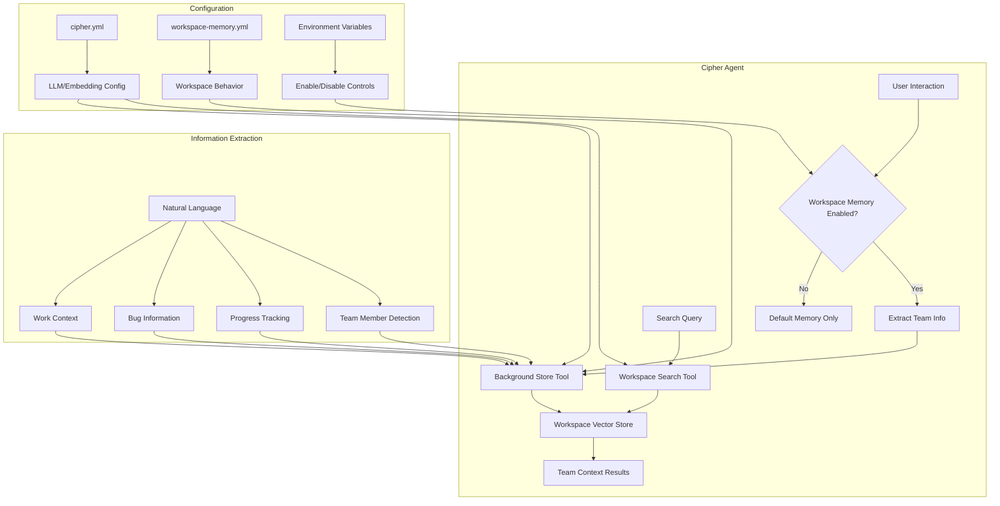
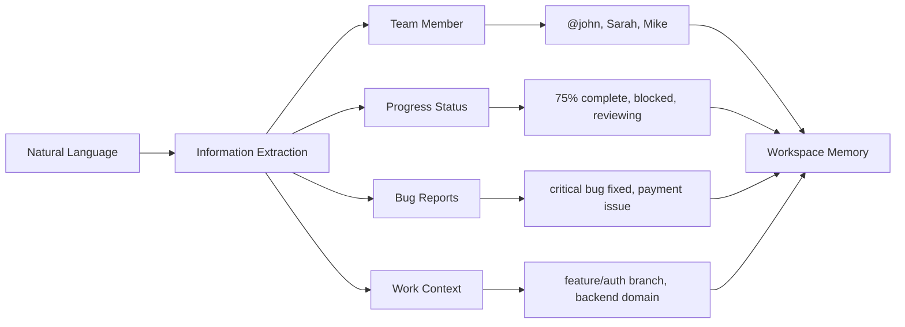
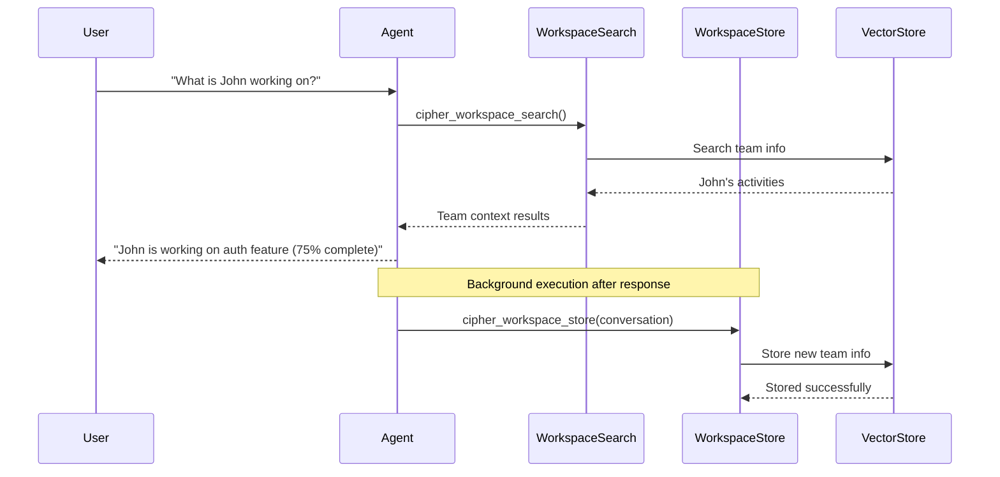
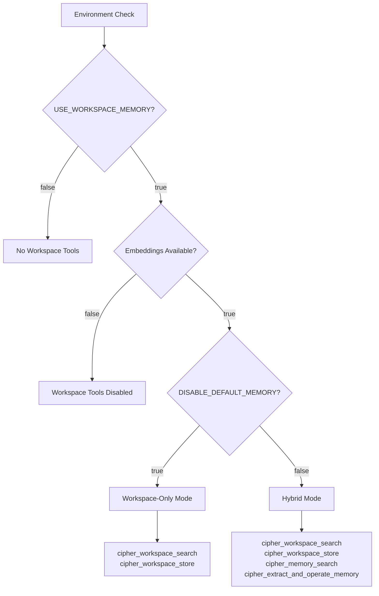
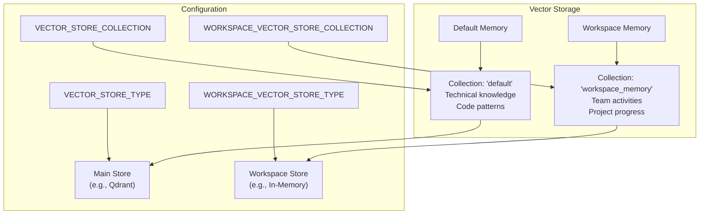
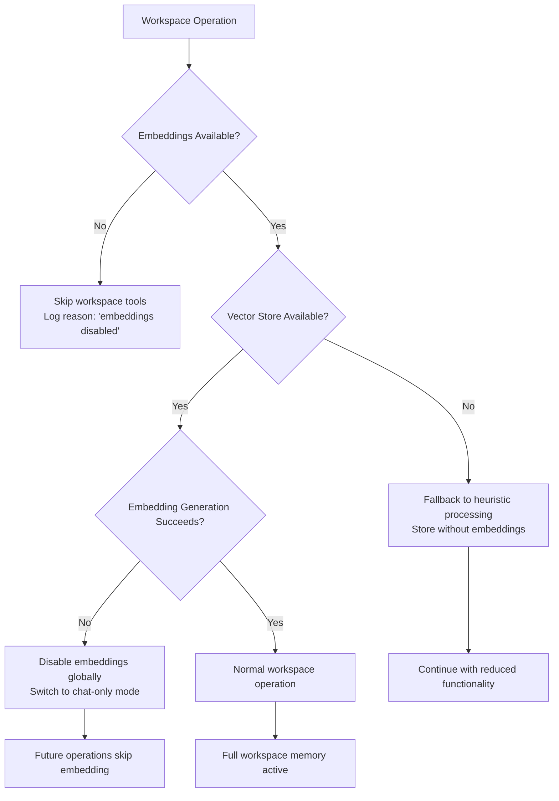

# Workspace Memory System

> **Team Collaboration Made Smart** - Automatically track project progress, team activities, and shared context with intelligent memory designed for modern development workflows.

## What Is Workspace Memory?

Workspace memory is Cipher's specialized memory system for teams. While Cipher's default memory focuses on technical knowledge and code patterns, workspace memory understands your team's collaborative work - tracking who's working on what, project progress, bug reports, and team context.

**Think of it as your team's shared brain** that automatically remembers:
- What John is working on this sprint
- Which bugs Sarah fixed last week  
- The status of the authentication feature
- Which repositories and branches are active
- Team progress across different projects

## Architecture Overview



## Core Capabilities

### 🧠 Smart Information Extraction
Automatically understands team communication and extracts structured data:
- **Team Members**: "@john is working on auth" → `teamMember: "john"`
- **Progress**: "authentication feature 75% complete" → `completion: 75, status: "in-progress"`
- **Bugs**: "fixed critical payment bug" → `severity: "critical", status: "fixed"`
- **Context**: "feature/auth branch" → `branch: "feature/auth"`

### 🔍 Intelligent Search
Find team information with natural language:
- "What is John working on?" → Returns John's current tasks
- "Recent bug fixes" → Shows latest resolved issues
- "Authentication feature status" → Progress updates

### 🔄 Background Processing
Automatically captures team information without manual intervention:
- Runs after each conversation
- Filters relevant team content
- Stores structured workspace data

## Quick Start Guide

### 1. Enable Workspace Memory

Add to your environment variables:
```bash
# Essential settings
USE_WORKSPACE_MEMORY=true

# Optional: Workspace-only mode (disables default memory)
DISABLE_DEFAULT_MEMORY=true

# Optional: Custom vector store settings
WORKSPACE_VECTOR_STORE_COLLECTION=my_team_memory
```

### 2. Verify Configuration

Workspace memory uses your existing LLM and embedding configuration from `memAgent/cipher.yml`. No additional setup required!

### 3. Start Using

Just talk naturally about your team's work:
```
"John is working on the authentication feature and it's about 75% complete"
"Sarah fixed a critical bug in the payment processing module"
"We deployed version 2.1.0 to staging yesterday"
```

Workspace memory automatically captures and organizes this information.

## How It Works

### Two Specialized Tools

#### 🔍 `cipher_workspace_search` (Agent-Accessible)
**Purpose**: Search team and project information  
**When Used**: When you ask about team activities, project status, or collaboration history  
**Example**: "What is John working on?" triggers this tool

#### 📝 `cipher_workspace_store` (Background-Only)
**Purpose**: Automatically capture team information  
**When Used**: After each conversation, runs in background  
**Example**: Automatically stores "John completed the auth feature"

### Information Storage Structure

Workspace memory organizes team information into structured data:



**What Gets Stored**:
- **Team Member**: Who is involved (`@john`, `Sarah completed`, `assigned to Mike`)
- **Progress**: What's being worked on and status (`75% complete`, `blocked on API`)
- **Bugs**: Issues and their resolution (`critical payment bug fixed`)
- **Context**: Repository, branch, project, domain (`feature/auth`, `backend`)
- **Confidence**: How certain the extraction is (0-1 scale)

## Configuration Guide

### Environment Variables

#### Required Settings
```bash
# Enable workspace memory
USE_WORKSPACE_MEMORY=true
```

#### Memory Mode Selection
```bash
# Workspace-only mode (recommended for teams)
DISABLE_DEFAULT_MEMORY=true  # Only workspace tools available

# Hybrid mode (default)
DISABLE_DEFAULT_MEMORY=false # Both workspace and technical memory
```

#### Vector Store Configuration
```bash
# Use separate collection (recommended)
WORKSPACE_VECTOR_STORE_COLLECTION=workspace_memory

# Optional: Different vector store type
WORKSPACE_VECTOR_STORE_TYPE=qdrant  # if different from main store
WORKSPACE_VECTOR_STORE_HOST=localhost
WORKSPACE_VECTOR_STORE_PORT=6333

# Storage limits
WORKSPACE_VECTOR_STORE_MAX_VECTORS=10000
WORKSPACE_VECTOR_STORE_DIMENSION=1536
```

### LLM and Embedding Integration

Workspace memory **automatically uses** your existing `memAgent/cipher.yml` configuration:

```yaml
# cipher.yml - Your existing configuration works automatically
llm:
  provider: openai
  model: gpt-4.1-mini
  apiKey: $OPENAI_API_KEY

# Embedding configuration (optional)
embedding:
  type: openai
  model: text-embedding-3-small
  apiKey: $OPENAI_API_KEY

# Workspace memory respects this config automatically!
# No additional LLM setup required
```

### Fallback Behavior

**When embeddings fail** (e.g., API key issues, rate limits):
1. **OpenAI fails** → Falls back to Ollama (if configured)
2. **All embedding providers fail** → Disables workspace tools gracefully
3. **`embedding: disabled: true`** → Excludes workspace tools entirely

### Advanced Configuration (Optional)

Create `memAgent/workspace-memory.yml` for custom behavior:

```yaml
# Workspace-specific settings
enabled: true
disable_default_memory: true

# Tool behavior
tools:
  search:
    similarity_threshold: 0.7    # How similar results must be
    max_results: 10             # Maximum search results
    timeout_ms: 15000           # Search timeout
  
  store:
    confidence_threshold: 0.6    # Minimum confidence to store
    batch_processing: true       # Process multiple items efficiently

# What triggers workspace actions
behavior:
  search_triggers:
    keywords: ["team", "project", "progress", "who is working"]
    patterns: ["who.*working.*on", "status.*of.*feature"]
  
  store_triggers:
    keywords: ["completed", "working on", "fixed", "deployed"]
    patterns: [".*completed.*feature", ".*fixed.*bug"]

# Performance tuning
performance:
  cache_enabled: true
  cache_ttl_seconds: 300       # 5 minute cache
  max_concurrent_operations: 3
```

## Real-World Usage Examples

### Automatic Information Capture

Workspace memory understands natural team communication:

#### Progress Updates
```
💬 "John is working on the user authentication feature and it's 75% complete"
🧠 Extracts: teamMember="John", feature="user authentication", completion=75%, status="in-progress"

💬 "@alice completed the payment integration yesterday"
🧠 Extracts: teamMember="alice", feature="payment integration", status="completed"

💬 "Mike is blocked on the API integration waiting for the backend team"
🧠 Extracts: teamMember="Mike", feature="API integration", status="blocked"
```

#### Bug Tracking
```
💬 "Sarah fixed a critical bug in the payment processing module"
🧠 Extracts: teamMember="Sarah", bug="payment processing", severity="critical", status="fixed"

💬 "Found a high priority issue with login form validation"
🧠 Extracts: bug="login form validation", severity="high", status="open"
```

#### Work Context
```
💬 "Deployed version 2.1.0 to staging. Repository: github.com/company/webapp"
🧠 Extracts: repository="company/webapp", domain="devops", version="2.1.0"

💬 "Working on feature/auth-improvements branch in the ecommerce project"
🧠 Extracts: branch="feature/auth-improvements", project="ecommerce"
```

### Smart Search Examples

#### Team Activity Queries
```
🔍 "What is John working on?"
→ Returns: John's current tasks, progress, and recent activities

🔍 "Who's working on the authentication feature?"
→ Returns: Team members assigned to auth-related work

🔍 "What did the team complete this week?"
→ Returns: Recently completed features and resolved bugs
```

#### Project Status Queries
```
🔍 "Status of the payment feature"
→ Returns: Progress updates, who's working on it, any blockers

🔍 "Recent bug fixes in the backend"
→ Returns: Backend bugs that were recently resolved

🔍 "What's deployed to staging?"
→ Returns: Recent deployments and environment info
```

#### Advanced Filtering
```
🔍 Query: "Recent work" + Filter: domain="frontend"
→ Returns: Only frontend-related activities

🔍 Query: "Project updates" + Filter: status="blocked"
→ Returns: Tasks that are currently blocked

🔍 Query: "Team progress" + Filter: team_member="Sarah"
→ Returns: Only Sarah's activities and progress
```

## Tool Execution Patterns

### Agent-Accessible vs Background Tools



**Key Differences**:
- **`cipher_workspace_search`**: Agent can call directly when needed
- **`cipher_workspace_store`**: Runs automatically in background after conversations

### Memory Mode Comparison

| Mode | Tools Available | Use Case |
|------|----------------|----------|
| **Workspace-Only** `DISABLE_DEFAULT_MEMORY=true` | Only team/project tools | Project management, team coordination |
| **Hybrid** `DISABLE_DEFAULT_MEMORY=false` | Both workspace + technical | Full development environment |
| **Default** `USE_WORKSPACE_MEMORY=false` | Only technical memory | Individual coding, no team features |

### Tool Registration Flow



## Intelligent Information Extraction

### Pattern Recognition Examples

#### Team Member Detection
| Input | Extracted |
|-------|----------|
| `@john completed the feature` | `teamMember: "john"` |
| `Sarah is working on authentication` | `teamMember: "Sarah"` |
| `assigned to Mike from backend team` | `teamMember: "Mike"` |
| `developer Alice implemented the fix` | `teamMember: "Alice"` |

#### Progress Status Recognition
| Input | Extracted |
|-------|----------|
| `authentication feature 75% complete` | `completion: 75, status: "in-progress"` |
| `payment module completed yesterday` | `status: "completed"` |
| `blocked on API integration` | `status: "blocked"` |
| `code review in progress` | `status: "reviewing"` |

#### Bug Severity Detection
| Input | Extracted |
|-------|----------|
| `fixed critical payment bug` | `severity: "critical", status: "fixed"` |
| `high priority login issue` | `severity: "high", status: "open"` |
| `resolved medium severity database problem` | `severity: "medium", status: "fixed"` |

#### Work Context Extraction
| Input | Extracted |
|-------|----------|
| `github.com/company/webapp repository` | `repository: "company/webapp"` |
| `feature/auth-improvements branch` | `branch: "feature/auth-improvements"` |
| `ecommerce project deployment` | `project: "ecommerce"` |
| `React component development` | `domain: "frontend"` |
| `database migration script` | `domain: "backend"` |
| `Docker container deployment` | `domain: "devops"` |

### Extraction Confidence Scoring

Workspace memory assigns confidence scores (0-1) based on:
- **Pattern clarity**: Clear patterns get higher confidence
- **Context richness**: More context increases confidence  
- **Consistency**: Information matching existing patterns

```
High Confidence (0.8-1.0): "@john completed authentication feature 100%"
Medium Confidence (0.6-0.7): "john working on auth stuff"
Low Confidence (0.4-0.5): "some progress on things"
```

## Data Architecture & Storage

### Vector Store Separation



**Benefits of Separation**:
- **No Data Conflicts**: Team and technical data don't interfere
- **Independent Scaling**: Different storage types for different needs
- **Isolated Configuration**: Separate tuning for team vs technical searches

### Fallback & Error Handling



**Error Recovery Strategies**:
1. **Embedding Failures**: Gracefully disable embeddings, continue with basic processing
2. **Vector Store Issues**: Fall back to heuristic-based storage
3. **Network Problems**: Retry with exponential backoff
4. **Configuration Errors**: Log issues, use safe defaults

### Performance Optimizations

#### Batch Processing
```
Single Message: Process → Store (1 operation)
Batch Messages: Process All → Store Batch (1 optimized operation)
```

#### Caching Strategy
```
Search Cache: 5-minute TTL for recent queries
Embedding Cache: Reuse embeddings for similar content
Result Cache: Cache formatted results for repeated searches
```

#### Async Operations
```
User Request → Immediate Response
              ↓ (background)
              Store Operation → Vector Database
```

## Migration & Compatibility

### Zero-Impact Adoption

✅ **Fully Backward Compatible**
- Existing Cipher installations work unchanged
- Default memory continues operating normally
- No data migration required

✅ **Gradual Enablement**
```bash
# Step 1: Enable workspace memory (existing memory still works)
USE_WORKSPACE_MEMORY=true

# Step 2: (Optional) Switch to workspace-only mode
DISABLE_DEFAULT_MEMORY=true
```

✅ **Safe Data Isolation**
- Workspace data: `workspace_memory` collection
- Technical data: `default` collection  
- No cross-contamination possible

### Migration Scenarios

#### Scenario 1: Add Team Features to Existing Setup
```bash
# Keep everything, add workspace memory
USE_WORKSPACE_MEMORY=true
DISABLE_DEFAULT_MEMORY=false  # Keep existing memory
```
**Result**: Technical memory + team memory both active

#### Scenario 2: Team-Focused Environment
```bash
# Focus on team collaboration
USE_WORKSPACE_MEMORY=true
DISABLE_DEFAULT_MEMORY=true   # Disable technical memory
```
**Result**: Only team/project memory active

#### Scenario 3: Rollback if Needed
```bash
# Disable workspace memory
USE_WORKSPACE_MEMORY=false
# System returns to original behavior
```
**Result**: Back to technical-only memory

### Team Onboarding

1. **Start with existing Cipher setup** (no changes needed)
2. **Add `USE_WORKSPACE_MEMORY=true`** to environment
3. **Begin team conversations** - memory starts learning automatically
4. **Optionally switch to workspace-only** if focused on team coordination

## Troubleshooting & Monitoring

### Quick Health Check

```bash
# Check if workspace memory is active
echo $USE_WORKSPACE_MEMORY  # Should be 'true'

# Verify vector store collection
echo $WORKSPACE_VECTOR_STORE_COLLECTION  # Should not equal $VECTOR_STORE_COLLECTION
```

### Common Issues & Solutions

#### Issue: "Workspace tools not appearing"
```
❌ Problem: USE_WORKSPACE_MEMORY=false or embeddings disabled
✅ Solution: Set USE_WORKSPACE_MEMORY=true and check embedding config
```

#### Issue: "No team information being stored"
```
❌ Problem: Content not recognized as team-related
✅ Solution: Use clearer team language (names, @mentions, progress %)
```

#### Issue: "Same collection name conflicts"
```
❌ Problem: WORKSPACE_VECTOR_STORE_COLLECTION equals VECTOR_STORE_COLLECTION
✅ Solution: Use different collection names (default: 'workspace_memory' vs 'default')
```

#### Issue: "Embedding failures"
```
❌ Problem: API key issues or rate limits
✅ Solution: Check cipher.yml embedding config, verify API keys
```

### Built-in Validation

```typescript
// Automatic validation on startup
const validation = validateWorkspaceMemorySetup();

if (!validation.isValid) {
  console.error('Configuration issues:', validation.issues);
}

if (validation.warnings.length > 0) {
  console.warn('Configuration warnings:', validation.warnings);
}
```

### Performance Monitoring

#### Search Performance
```
Log Output:
- Search time: 150ms
- Embedding time: 45ms  
- Results found: 3
- Max similarity: 0.87
```

#### Storage Performance
```
Log Output:
- Extracted facts: 2
- Stored items: 2
- Processing time: 200ms
- Confidence: 0.8
```

#### Error Tracking
```
Log Output:
- Embedding failures: 0
- Vector store errors: 0
- Fallback activations: 1 (network timeout)
```

### Debugging Tools

#### Enable Debug Logging
```bash
CIPHER_LOG_LEVEL=debug
```

#### Validation Script
```typescript
import { validateWorkspaceMemorySetup } from './workspace-tools.js';

// Run validation
const result = validateWorkspaceMemorySetup();
console.log('Workspace memory status:', result);
```

## Best Practices

### Team Communication Patterns

#### ✅ Effective Patterns
```
✅ "@john completed the authentication feature 100%"
✅ "Sarah is working on payment integration - currently 60% done"
✅ "Fixed critical bug in user registration process"
✅ "Deployed version 1.2.0 to staging environment"
✅ "Mike blocked on API integration, waiting for backend team"
```

#### ❌ Patterns to Avoid
```
❌ "Someone did something"  (too vague)
❌ "Made some progress"      (no specifics)
❌ "Fixed stuff"            (unclear what/who)
❌ "Working on things"       (no context)
```

### Optimal Configuration

#### For Small Teams (2-5 people)
```bash
USE_WORKSPACE_MEMORY=true
DISABLE_DEFAULT_MEMORY=true  # Focus on team coordination
WORKSPACE_VECTOR_STORE_TYPE=in-memory  # Sufficient for small scale
```

#### For Medium Teams (5-20 people)
```bash
USE_WORKSPACE_MEMORY=true
DISABLE_DEFAULT_MEMORY=false  # Keep technical memory too
WORKSPACE_VECTOR_STORE_TYPE=qdrant  # Better performance
WORKSPACE_VECTOR_STORE_MAX_VECTORS=25000
```

#### For Large Teams (20+ people)
```bash
USE_WORKSPACE_MEMORY=true
WORKSPACE_VECTOR_STORE_TYPE=qdrant
WORKSPACE_VECTOR_STORE_MAX_VECTORS=100000
# Consider multiple Cipher instances per team/project
```

### Team Workflow Integration

#### Daily Standups
```
💬 "Yesterday I completed the user profile feature"
💬 "Today I'm working on email notification system"
💬 "I'm blocked on database migration - need DevOps help"
```
→ Workspace memory automatically tracks progress and blockers

#### Sprint Planning
```
🔍 "What did we complete last sprint?"
🔍 "Who's available for the authentication work?"
🔍 "What bugs are still open?"
```
→ Search provides instant sprint insights

#### Code Reviews
```
💬 "John's pull request for feature/payment-integration is ready for review"
💬 "Found a security issue in the login component during review"
```
→ Captures review status and issues automatically

### Performance Tuning

#### Similarity Thresholds
```
# Conservative (fewer duplicates, might miss similar items)
similarity_threshold: 0.8

# Balanced (good for most teams)
similarity_threshold: 0.7  # Default

# Aggressive (catches more similar items, may group unrelated)
similarity_threshold: 0.6
```

#### Cache Settings
```
# High-activity teams (frequent updates)
cache_ttl_seconds: 180  # 3 minutes

# Normal activity teams
cache_ttl_seconds: 300  # 5 minutes (default)

# Low-activity teams (infrequent updates)  
cache_ttl_seconds: 600  # 10 minutes
```

## Advanced Use Cases

### Multi-Project Tracking
```bash
# Separate workspace memory per project
WORKSPACE_VECTOR_STORE_COLLECTION=project_alpha_memory
# Use different Cipher instances or collections for each project
```

### Cross-Team Integration
```
💬 "Backend team completed the API endpoints"
💬 "Frontend team can now integrate with the new user service"
💬 "DevOps deployed the staging environment for testing"
```
→ Track dependencies and coordination across teams

### Release Management
```
🔍 "What features are ready for the v2.0 release?"
🔍 "Any blockers for next week's deployment?"
🔍 "Which bugs were fixed since last release?"
```
→ Get instant release readiness insights

### Remote Team Coordination
```
💬 "John (US timezone) handed off the database work to Sarah (EU timezone)"
💬 "Async code review completed by Mike, approved for merge"
```
→ Track handoffs and async collaboration

## Future Roadmap

### Planned Enhancements
- **🔌 External Tool Integration**: Jira, GitHub, Slack webhooks
- **📊 Team Analytics**: Visual insights into productivity and collaboration
- **🤖 Smart Notifications**: AI-powered alerts for blockers and opportunities
- **📱 Mobile-Friendly**: Optimized for mobile team updates
- **🔐 Advanced Permissions**: Role-based access to team information

### Community Contributions
Workspace memory is designed for extension. Consider contributing:
- Custom domain extractors (e.g., design workflows, QA processes)
- Integration plugins for popular tools
- Team productivity analytics
- Advanced search capabilities

---

## Summary

**Workspace Memory transforms Cipher into a team-aware AI assistant** that understands your collaborative work, tracks progress automatically, and provides instant insights into team activities.

**Key Benefits:**
- 🧠 **Automatic Learning**: Captures team information without manual input
- 🔍 **Instant Insights**: Search team activities with natural language
- 🔧 **Zero Setup**: Uses existing Cipher LLM/embedding configuration
- 🛡️ **Safe Integration**: Backward compatible, no risk to existing setups
- ⚡ **High Performance**: Optimized for real-time team environments

**Ready to get started?** Add `USE_WORKSPACE_MEMORY=true` to your environment and start talking about your team's work!